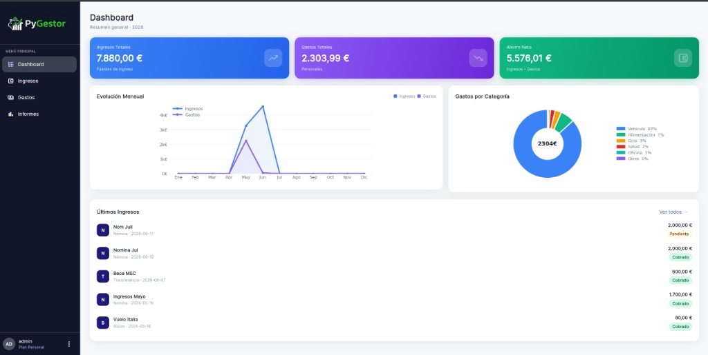

# PyGestor - Sistema de Gestión Financiera Multiplataforma

[](https://www.python.org/)
[](https://flet.dev/)
[](https://www.sqlite.org/)
[](https://matplotlib.org/)

**PyGestor** es una solución de escritorio multiplataforma orientada a la administración y análisis de finanzas personales. Centraliza el registro de flujos de caja (ingresos y gastos), la clasificación por centros de coste y la proyección analítica en tiempo real mediante un cuadro de mando con visualizaciones dinámicas integradas.

<p align="center">
  
</p>

---

## 🚀 Características Principales

* **Control de Acceso y Autenticación:** Módulo de autenticación local que restringe el acceso al aplicativo y asegura el aislamiento de la información entre perfiles.
* **Cuadro de Mando Ejecutivo (Dashboard):** Visualización consolidada de métricas clave (ingresos acumulados, gastos totales y balance neto) junto a un histórico reciente de transacciones.
* **Gestión de Transacciones:**
  * **Ingresos:** Registro de entradas de capital con seguimiento de estado operativo (`Cobrado` / `Pendiente`) y atributos de origen, concepto y fecha.
  * **Gastos:** Clasificación sistemática de egresos por categorías predefinidas, con soporte completo para operaciones de edición y borrado.
* **Módulo de Analítica Financiera:**
  * Monitorización comparativa mensual de entradas frente a salidas de capital.
  * Distribución porcentual del consumo mediante diagramas de sectores.
  * Análisis agregado y tablas de rendimiento por trimestres fiscales (T1-T4).
* **Gestión de Configuración y Perfil:** Administración de preferencias de usuario, parámetros de cuenta y visualización de niveles de suscripción.
* **Arquitectura de Interfaz Adaptativa:** Diseño SPA (*Single Page Application*) construido con maquetación elástica para garantizar usabilidad en diversas resoluciones de pantalla.

---

## 🛠️ Stack Tecnológico

* **Lenguaje de Programación:** Python 3.12
* **Capa de Presentación (UI):** Flet (entorno reactivo basado en Flutter)
* **Capa de Persistencia:** SQLite (motor relacional embebido para almacenamiento local seguro)
* **Motor Estadístico:** Matplotlib (procesamiento y vectorización gráfica en memoria mediante búfer de bytes)

---

## 📂 Arquitectura del Repositorio

El proyecto implementa una separación estricta de responsabilidades:

```text
PyGestor/
├── assets/                     # Recursos estáticos de la interfaz
├── backend/
│   ├── database.py             # Capa de acceso a datos y abstracción relacional
│   ├── logic.py                # Lógica de negocio y motor de agregación contable
│   └── models.py               # Modelos de entidades de dominio
├── frontend/
│   ├── dashboard.py            # Vista principal del cuadro de mando
│   ├── formulario_gasto.py     # Componentes de entrada y edición de gastos
│   ├── formulario_ingreso.py   # Componentes de entrada y edición de ingresos
│   ├── gastos.py               # Vistas tabulares y filtrado de gastos
│   ├── graficos.py             # Generación en memoria de representaciones analíticas
│   ├── informes.py             # Panel de agregación y reportes trimestrales
│   ├── ingresos.py             # Vistas tabulares y conciliación de ingresos
│   ├── login.py                # Flujos de autenticación y alta de usuario
│   ├── perfil.py               # Panel de preferencias y configuración
│   └── styles.py               # Sistema de diseño, tokens cromáticos y componentes
├── main.py                     # Punto de entrada y orquestador del ciclo de vida
└── requirements.txt            # Dependencias del entorno